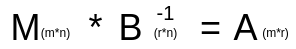
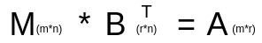

# Alice Car Shop
[Task](task.pdf)
## Run:
~~~
:~$ mkdir build
:~$ cmake -S . -B build && cmake --build build
:~$ ./build/AliceShop input_file.txt
~~~
## Algorithm:
* Firstly, algorithm finds the point from witch the observations are made, and corresponding basis.

  Gram-Schmidt process is used for this step.
  
  
  
  On the output of process we will have matrix(r*n), where r - rank of matrix(r <= n)
* Secondly,  we will use this basis for transforming to normal basis.

  

  Since B - orthogonal, we can find inverse matrix as transposed matrix.

  
* The third step of algorithm is finding equals between instance matrix in normal basis and matrices in database in normal basis. 

